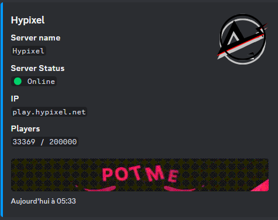
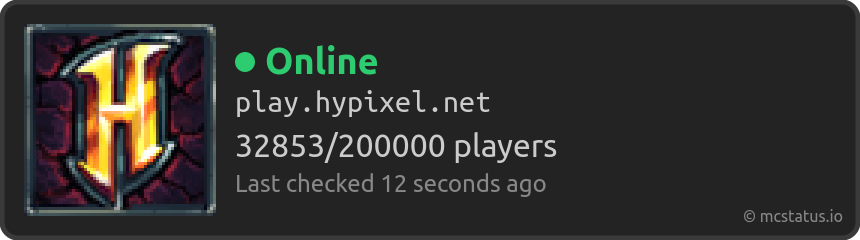

# Minecraft Discord Bot

A Discord bot that displays real-time information about any Minecraft server (Java or Bedrock) in a Discord server.

## Features

- Displays the status of any Minecraft server (Java or Bedrock).
- Customizable widgets and embeds with titles, colors, and images.
- Easy configuration via a JSON file.

## Prerequisites

- **Node.js v16 or higher**: Required to run the bot.
- **A Discord server**: Where the bot will operate.
- **A Discord bot**: You need to create a bot and obtain its token from the [Discord Developer Portal](https://discord.com/developers/applications).
- **The following npm packages**:
  - `axios`: For making HTTP requests.
  - `discord.js`: The main library to interact with the Discord API.
  - `node-cron`: For scheduling tasks like checking server status periodically.


## How to Install

1. **Clone the repository:**
    ```bash
    git clone https://github.com/RudyDinis/minecraft-discord-bot.git
    cd minecraft-discord-bot
    ```

2. **Install dependencies:**
    ```bash
    npm install
    ```

3. **Configure the bot:**
    - Create a `config.json` file at the root of the project.
    - Copy and paste the following content into the `config.json` file and update it with your information:
        ```json
        {
            "token": "yourbottoken",
            "clientId": "yourbotid",
            "server_ip": "play.server.net",
            "edition": "java or bedrock",
            "widget": {
                "channel_id": "id of your widget channel",
                "dark" : "true or false"
            },
            "embed": {
                "channel_id": "id of your embed channel",
                "color" : "0x0099FF",
                "title" : "Server Name",
                "title_url" : "https://serverwebsite.com",
                "logo" : "./img/logo.png",
                "image" : "./img/image.gif"
            }
        }
        ```
    - Fill in each field:
        - `token`: Your Discord bot token.
        - `clientId`: Your bot's ID.
        - `server_ip`: The IP of the Minecraft server you want to monitor.
        - `edition`: The Minecraft edition (`java` or `bedrock`).
        - `widget.channel_id`: The ID of the Discord channel where the widget will be displayed.
        - `widget.dark`: Display in dark mode (`true`) or light mode (`false`).
        - `embed.channel_id`: The ID of the Discord channel where the embed will be sent.
        - `embed.color`: Embed color in hexadecimal code.
        - `embed.title`: The title of the embed (server name).
        - `embed.title_url`: The server's website URL.
        - `embed.logo`: Path to the logo used in the embed.
        - `embed.image`: Path to the main image used in the embed.

4. **Run the bot:**
    ```bash
    node index.js
    ```

## Example

1. **Embed**



2. **widget**



## Usage

Once the bot is running, it will display real-time information about the Minecraft server in the configured Discord channels. You can customize the widgets and embeds by modifying the `config.json` file and restarting the bot.

## Contributing

Contributions are welcome! Please create an issue or a pull request to suggest changes.
